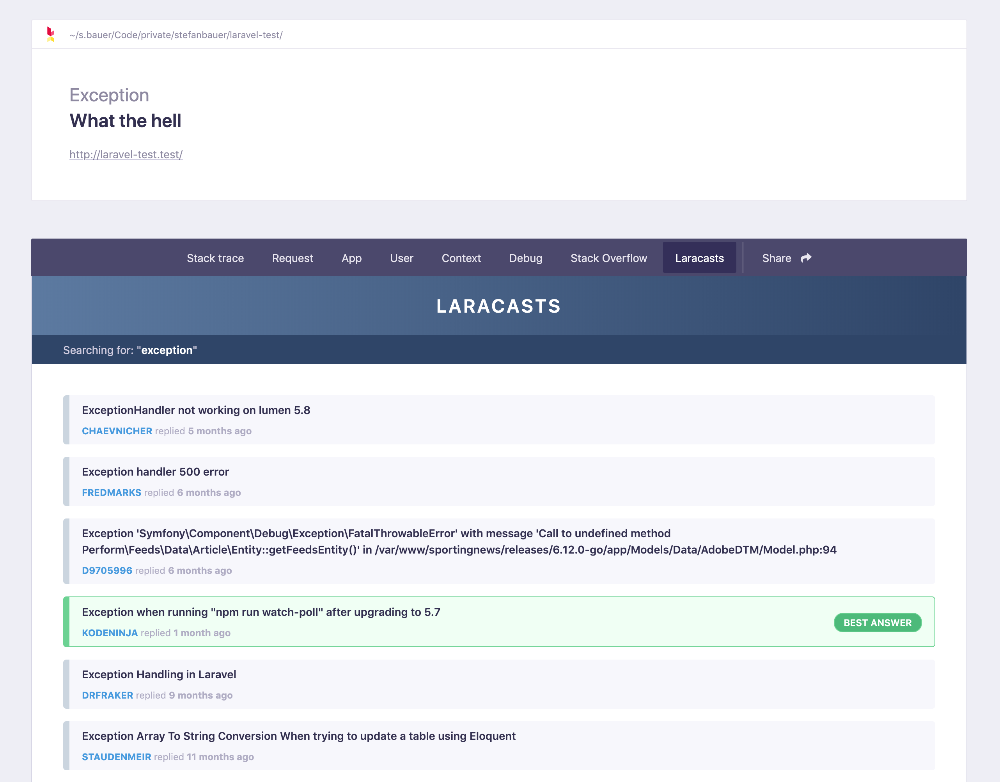

# A tab to retrieve laracasts.com answers

[](https://packagist.org/packages/stefanbauer/ignition-laracasts-tab)
[](https://travis-ci.org/stefanbauer/ignition-laracasts-tab)
[](https://packagist.org/packages/stefanbauer/ignition-laracasts-tab)

This package adds a tab which shows matching [laracasts.com](https://laracasts.com) forum answers.



## Installation

You can install the package in to a Laravel app that uses [Ignition](https://flareapp.io) via composer:

```bash
composer require stefanbauer/ignition-laracasts-tab
```

## Usage

Click on the "Laracasts" tab on your Ignition screen to see the tool provided by this package.

### Testing

``` bash
composer test
```

### Changelog

Please see [CHANGELOG](CHANGELOG.md) for more information on what has changed recently.

## Contributing

Please see [CONTRIBUTING](CONTRIBUTING.md) for details.

### Security

If you discover any security related issues, please email mail@stefanbauer.me instead of using the issue tracker.

## Credits

- [Stefan Bauer](https://github.com/stefanbauer)
- All contributors

## License

The MIT License (MIT). Please see [License File](LICENSE.md) for more information.
